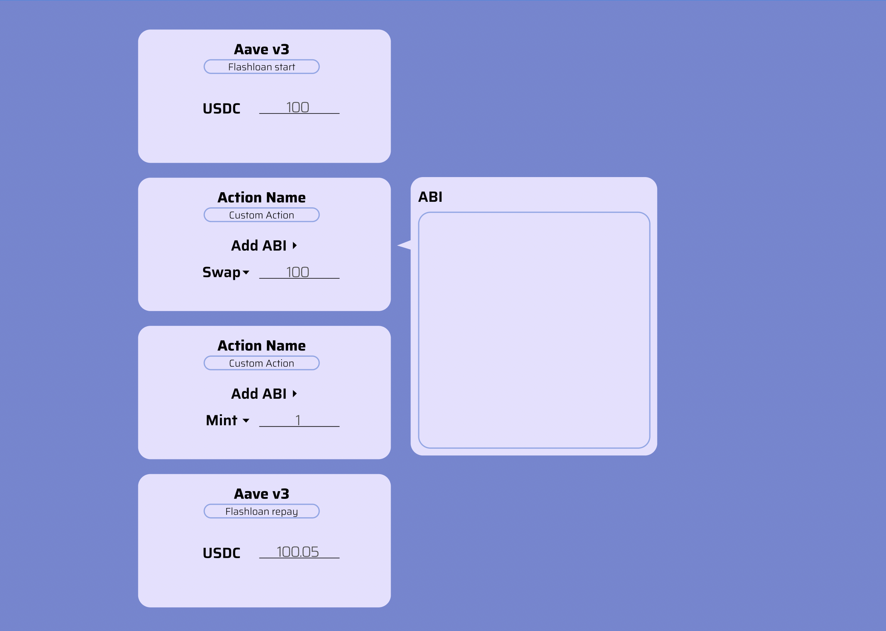

# Aave Grant Proposal

## Overview

Our plan is to build a User Experience solution that allows users to avail flashloan through Aave and then perform arbitrary tasks inside the scope in a serialised manner, this can include arbitrage, leveraged trading, proposal voting and more.

As of now if anyone wants to perform arbitrary tasks using flash loans they have to write and deploy their own smart contracts which can be expensive and is a barrier to non technical users.

Competing projects are highly limited in the scope of what they allow users to do and are non focused on providing best user experience for Flashloans whereas that is exactly where our focus is going to be!

## User Journey

Bob wants to create an arbitrage between two Uni fork DEXes:

1. He would come to our website and start by choosing an asset and amount
2. He add in the Uniswap ABI or can choose from our selection of ABIs and creates a custom action
3. He swaps asset token for token B on DEX A
4. He swaps back to asset token on DEX B
5. He repays flashloan with fees

## Technical Specs

We are proposing 2 main methods to accomplish this:

### 1. Flashloan Wallet

Each user gets their own copy of flashloan wallet which works through proxy clone and allows users to send serialised calls to these contracts after availing the flashloan.

We would use `call` method under the hood along with encoded params and function signature from the ABI to perform these tasks. Our frontend would handle the function encoding and the contract would perform these transaction on chain.

In case user ends up with arbitrary tokens locked in this contract they'll be able to easily retrieve it through owner exclusive retrieve actions to the contract.

### 2. Community Wallet

A general wallet that does the exact same thing as user specific wallet but does not require seperate deployment but also does not have owner restrictions.

We will charge users a fee on top of the flashloan fee for community wallet and a deployment fee for individual wallet.
